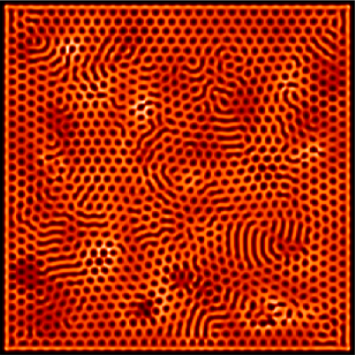

# Gray-Scott-Simulation

The purpose of this repository is to provide a didactic example of a numerical solution of a Gray-Scott reaction-diffusion system. The code included here was implemented in Python avalible on "gray_scott_simulation.py" and in colab link: 

The ray-Scott reaction-diffusion system can be mathematically expressed by following differential equation:

## Acknowledgments
Alexandre Benatti thanks Coordenação de Aperfeiçoamento de Pessoal de Nível Superior - Brasil (CAPES) - Finance Code 001. Luciano da F. Costa thanks CNPq (grant no. 307085/2018-0) and NAP-PRP-USP for sponsorship. This work has been supported also by FAPESP grants 11/50761-2 and 2015/22308-2.
