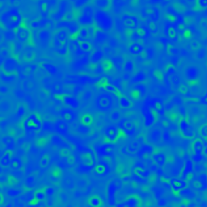

The purpose of this repository is to provide didactic examples of numerical solutions of a Gray-Scott reaction-diffusion system and Belousov-Zhabotinsky Simulation. The codes included here were implemented in Python available on "gray_scott_simulation.py" and "belousov-zhabotinsky_simulation.py".

# Gray-Scott Reaction

Simulation colab link: 

The ray-Scott reaction-diffusion system can be mathematically expressed by following differential equation:

)

v)

# Belousov-Zhabotinsky Simulation

Simulation colab link: [

A comun simplification of Belousov-Zhabotinsky reaction is expressed by following differential equation:

## License

This Deep Learning Tutorial is licensed under a Creative Commons Attribution-NonCommercial-NoDerivatives 4.0 (CC BY-NC-ND 4.0) International License.

## Acknowledgments
Alexandre Benatti thanks Coordenação de Aperfeiçoamento de Pessoal de Nível Superior - Brasil (CAPES) - Finance Code 001. Luciano da F. Costa thanks CNPq (grant no. 307085/2018-0) and NAP-PRP-USP for sponsorship. This work has been supported also by FAPESP grants 11/50761-2 and 2015/22308-2.
